# Business Ranking Report
1. Context

Received a request from the finance department to create these two reports and process data daily, saving the results to an Excel file on Google Drive.

2. Implementation

Flowchart:
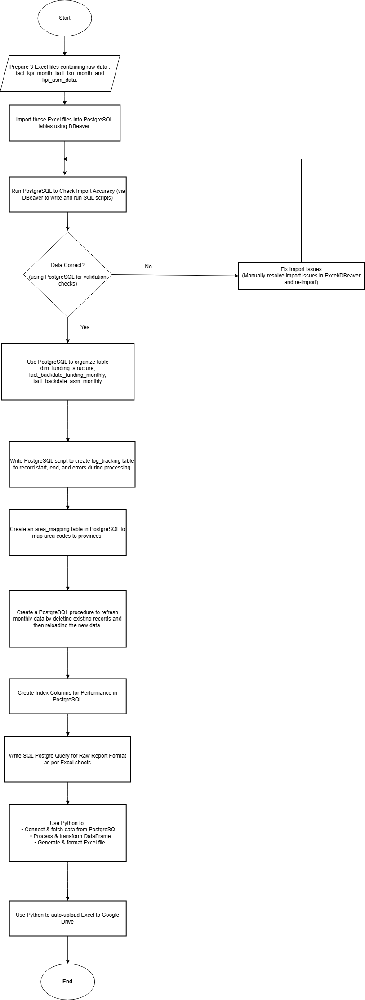

Description of Implementation Steps:

2.1. Input Data Flow:

Use DBeaver to import data from 3 Excel files into 3 tables: fact_kpi_month, fact_txn_month, and kpi_asm_data.

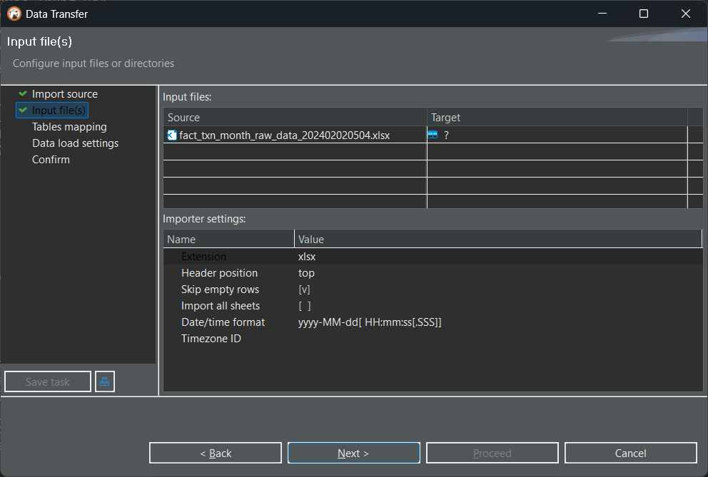

2.2. Data Validation:

Write SQL scripts to verify the accuracy of the imported data.

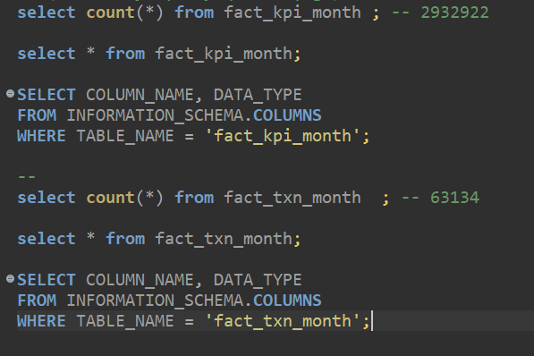

2.3. Data Model Organization (Dimension & Fact):

Objective: Optimize storage.

* Summary Report:

    * Dimension table: dim_funding_structure

    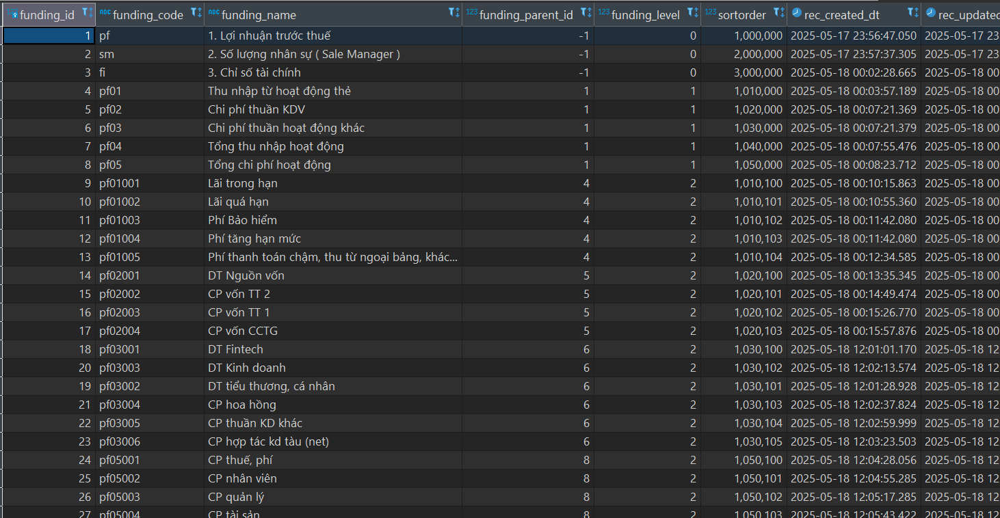
    
    * Fact table: fact_backdate_funding_monthly

    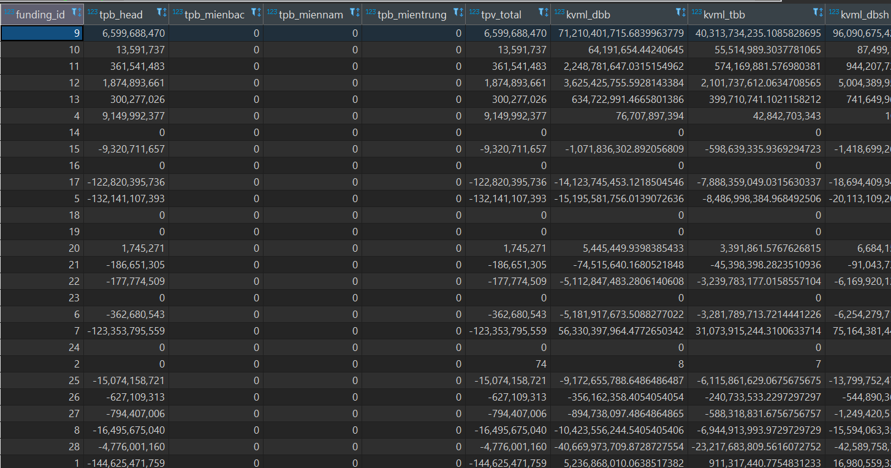

* ASM Ranking Report:
    * Fact table: fact_backdate_asm_monthly
    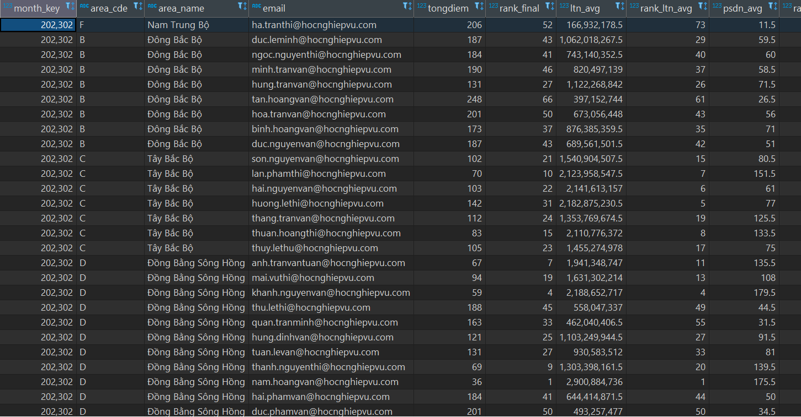

2.4. Create log_tracking Table:

Record the start time, end time, and any errors (if applicable) during the processing.

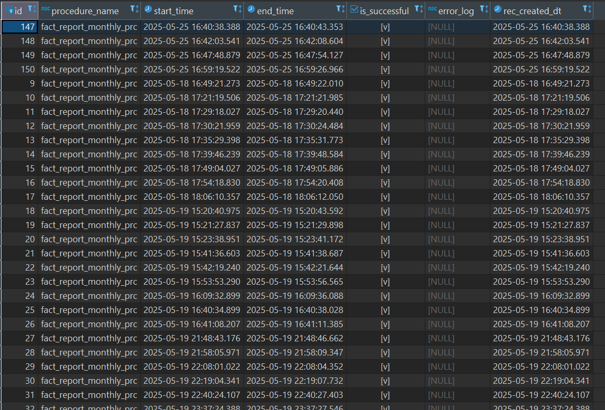

2.5. Create area_mapping Table:

Map area_code to the corresponding list of provinces.

2.6. Write Stored Procedure:

When passing the target month as a parameter:
* Delete data for that month from the relevant tables.
* Load new processed data into the tables.
* Construct SQL queries to retrieve data in the required format for the two report sheets.

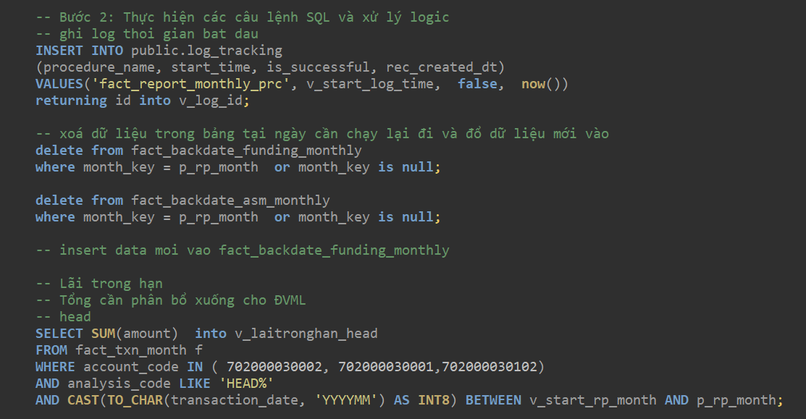

2.7. Indexing:

Create indexes on key columns from the input data to improve the performance of the Stored Procedure.

2.8. Build Queries for Sheets:

Develop SQL queries to retrieve data in the exact format required for each sheet in the resulting Excel file.

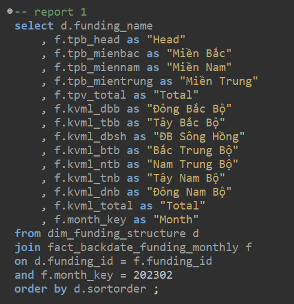

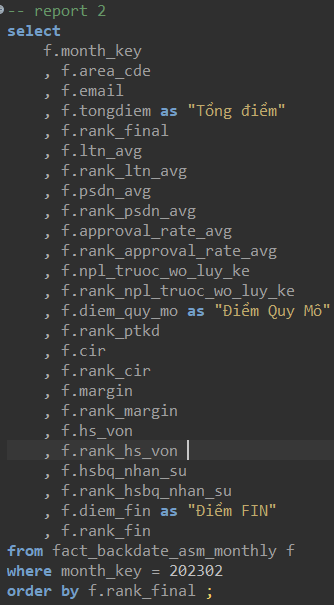

2.9. Execute with Python:

* Use Python to execute the SQL queries.

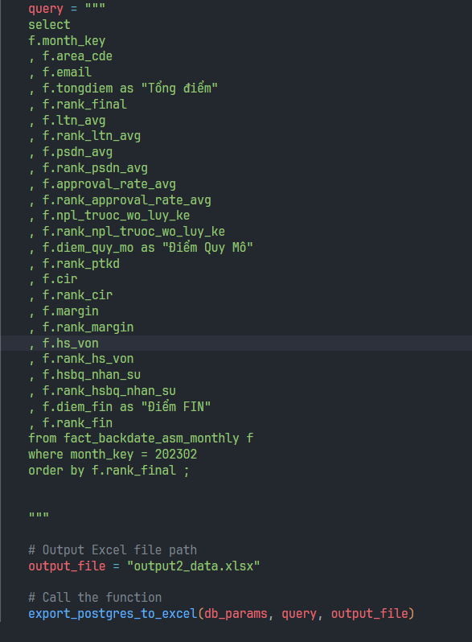

* Modify Python code to apply custom formatting to the Excel file (e.g., set fonts, apply cell colors, adjust column widths, and configure number formats).

* Write the results to an Excel file.

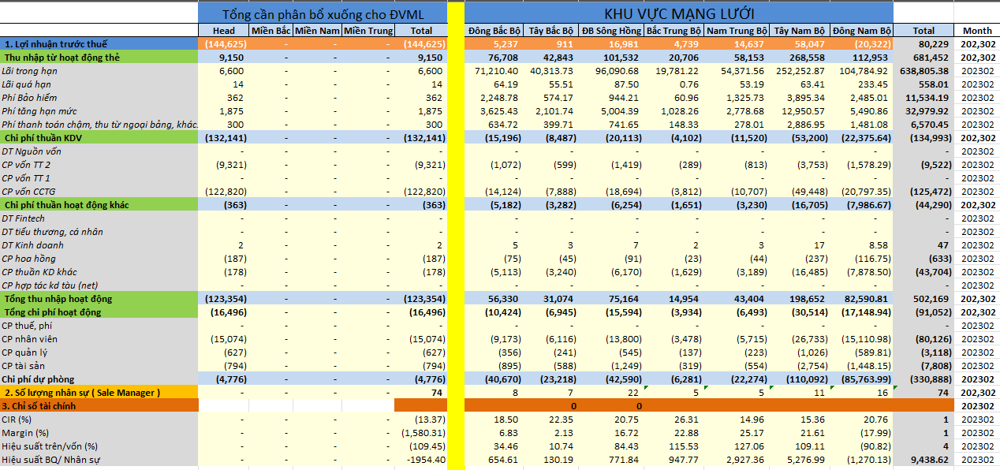

2.10. Auto-Upload to Google Drive

After generating and formatting the Excel file, use Python’s Google Drive API client to authenticate (via OAuth or service account) and automatically upload or overwrite the file in a specified Drive folder.

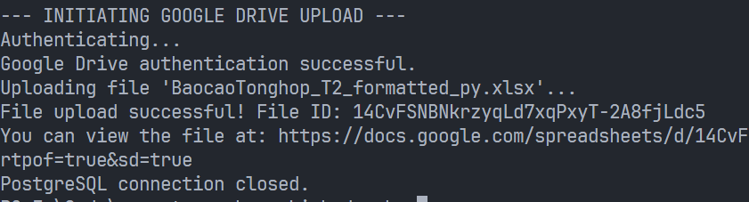

3. Skills and Achievements After Completing the Project

Completing this project enhances tool skills, technical skills, and domain knowledge as follows:

3.1. Tool Skills

PostgreSQL / DBeaver
* Write and optimize complex queries against a PostgreSQL database.
* Use DBeaver to browse tables, run SQL scripts, and import/export data to/from Excel.

Excel / openpyxl
* Automate creation of Excel workbooks via Python (pandas.ExcelWriter + openpyxl).
* Apply cell-level formatting (fonts, fills, alignments, number formats) programmatically with openpyxl.

Python IDE (VS Code)
* Develop, debug, and run Python scripts that integrate database queries, data transformations, and Excel generation.

Google Drive API
* Authenticate via OAuth2 in a Python script (using google-auth, google-auth-oauthlib).
* Upload or overwrite files in Drive automatically using googleapiclient and MediaFileUpload.

3.2. Technical Skills
SQL
* Extract and transform reporting data from fact tables (e.g., fact_backdate_funding_monthly).
* Handle filtering, sorting, and joins to retrieve KPI columns for financial analysis.

Python
* Connect to PostgreSQL with psycopg2, execute queries, and handle exceptions to ensure safe cleanup.
* Process query results in pandas.DataFrame, including clearing specific rows/columns, scaling numeric values, and rounding.
* Generate an Excel file with pandas + openpyxl and apply:
    * Column headers styling (fonts, fills, alignment).
    * Row-and-cell-level formatting (color fills, merged headers, column widths, row heights, custom number formats).
* Integrate Google Drive upload:
    * Authenticate via InstalledAppFlow or service account.
    * Build a Drive client (build('drive', 'v3', ...)) and use MediaFileUpload to push the finalized Excel file to a specified folder.
    * Automate the upload step so that every script run overwrites or creates the report on Drive without manual intervention.

3.3. Domain Knowledge
Finance Reporting
* Understand key financial metrics (e.g., budgets, totals, regional allocations) and how they feed into monthly/quarterly reports.
* Interpret and manipulate financial KPIs for accurate presentation.

Data Management / ETL
* Extract, transform, and load (ETL) raw data from PostgreSQL into a polished Excel report.
* Validate, clean, and restructure tabular data to meet business requirements.
