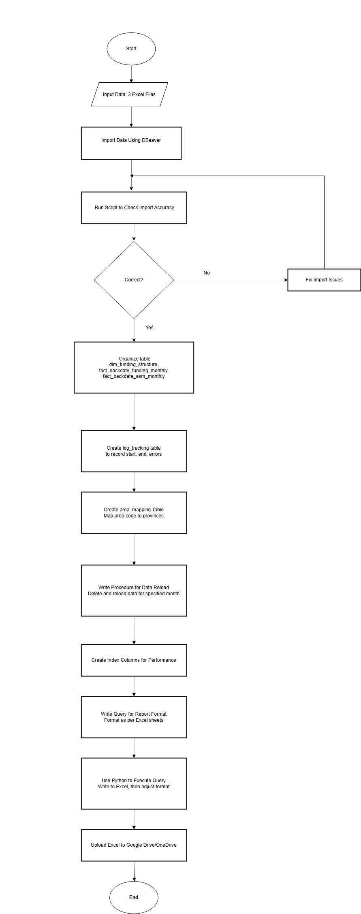

Báo cáo Xếp hạng Kinh doanh
1. Ngữ cảnh

Nhận yêu cầu của phòng tài chính để làm 2 báo cáo này và chạy số hằng ngày, ghi kết quả vào file Excel trên Google Drive.

2. Thực hiện

Flowchart:

Mô tả từng bước thực hiện:

2.1.  Luồng Input Data:
* Sử dụng DBeaver để import dữ liệu từ 3 file Excel vào 3 bảng: fact_kpi_month, fact_txn_month, và kpi_asm_data.

2.2.  Kiểm tra Dữ liệu:
* Viết script SQL để kiểm tra tính chính xác của dữ liệu đã import.

2.3.  Tổ chức Mô hình Dữ liệu (Dimension & Fact):
* Mục tiêu: Lưu trữ tối ưu.
* Báo cáo tổng hợp:
* dim_funding_structure
* fact_backdate_funding_monthly
* Báo cáo xếp hạng ASM:
* fact_backdate_asm_monthly

2.4.  Tạo Bảng log_tracking:
* Ghi nhận thời gian bắt đầu, kết thúc và các lỗi (nếu có) trong quá trình xử lý.

2.5.  Tạo Bảng area_mapping:
* Mapping (ánh xạ) area_code với danh sách tỉnh tương ứng.

2.6.  Viết Stored Procedure:
* Khi truyền tham số tháng cần chạy lại:
* Xóa dữ liệu của tháng đó trong các bảng liên quan.
* Đổ dữ liệu mới đã xử lý vào.
* Dựng câu query SQL để truy vấn số liệu theo định dạng yêu cầu của 2 sheet báo cáo.

2.7.  Đánh Index:
* Tạo index cho các cột quan trọng từ dữ liệu đầu vào để giúp Stored Procedure chạy nhanh hơn.

2.8.  Dựng Câu Query cho Sheet:
* Xây dựng các câu query SQL để truy vấn số liệu theo đúng định dạng của từng sheet trong file Excel kết quả.

2.9.  Thực thi bằng Python:
* Sử dụng Python để thực thi các câu query SQL.
* Ghi kết quả ra file Excel.
* Điều chỉnh định dạng cho file Excel (font, màu sắc, độ rộng cột,...).

2.10. Upload lên Google Drive:
* Tự động tải file Excel đã hoàn thiện lên Google Drive.

3. Kỹ năng và đạt được sau khi hoàn thành project

Hoàn thành dự án này giúp nâng cao các kỹ năng công cụ (tool skills), kỹ năng công nghệ (tech skills), và hiểu biết trong các lĩnh vực (domain) sau:

3.1. Kỹ năng Công cụ (Tool Skills)

* PostgreSQL/DBeaver: Thành thạo sử dụng PostgreSQL để truy vấn dữ liệu và DBeaver để quản lý, import/export dữ liệu từ Excel.

* Excel: Kỹ năng xử lý và xuất dữ liệu sang file Excel thông qua tự động hóa bằng Python.
* Python IDE (VS Code/PyCharm): Sử dụng môi trường phát triển để viết, debug và chạy script Python hiệu quả.

3.2. Kỹ năng Công nghệ (Tech Skills)

* SQL:
    * Viết và tối ưu hóa các câu query SQL phức tạp để trích xuất dữ liệu từ PostgreSQL (ví dụ: truy vấn bảng fact_backdate_asm_monthly với các cột xếp hạng và KPI).

    * Xử lý dữ liệu lớn với các điều kiện lọc và sắp xếp.

    * Sử dụng Stored Procedure để tự động hóa quy trình.

* Python:
    * Sử dụng thư viện psycopg2 để kết nối và truy vấn cơ sở dữ liệu PostgreSQL.
    * Xử lý dữ liệu với pandas để tạo DataFrame và xuất ra file Excel.
    * Quản lý lỗi và kết nối cơ sở dữ liệu thông qua try-except và đảm bảo đóng kết nối an toàn.

* Database Management:
    * Hiểu cách truy xuất và quản lý dữ liệu trong các bảng fact để phục vụ báo cáo.
    * Kỹ năng xử lý các cột dữ liệu phức tạp như KPI tài chính và xếp hạng.

3.3. Lĩnh vực (Domain)

* Tài chính (Finance):
    * Hiểu sâu về các chỉ số KPI tài chính (ví dụ: tongdiem, ltn_avg, approval_rate_avg, npl_truoc_wo_luy_ke) và báo cáo xếp hạng ASM.
    * Nắm bắt cách tổ chức dữ liệu để phục vụ báo cáo tài chính và đánh giá hiệu suất.

* Quản lý Dữ liệu (Data Management):
    * Kỹ năng trích xuất, kiểm tra và xử lý dữ liệu từ cơ sở dữ liệu để đảm bảo tính chính xác.

    * Áp dụng quy trình ETL trong việc chuyển đổi dữ liệu thô thành báo cáo có định dạng.

Dự án này giúp nâng cao khả năng sử dụng SQL và Python trong việc tự động hóa báo cáo tài chính, đồng thời cải thiện hiểu biết về quản lý dữ liệu và quy trình tài chính trong doanh nghiệp.

