## Business Ranking Report
- [1. Context](#1-context)
- [2. Implementation](#2-implementation)
  - [2.1. Input/Output Overview](#21-inputoutput-overview)
    - [2.1.1. Input Tables:](#211-input-tables)
    - [2.1.2. Output Reports:](#212-output-reports)
  - [2.2. Data Model Organization (Dimension \& Fact):](#22-data-model-organization-dimension--fact)
    - [2.2.1. Summary Report:](#221-summary-report)
    - [2.2.2. ASM Ranking Report:](#222-asm-ranking-report)
  - [2.3. Create log\_tracking Table:](#23-create-log_tracking-table)
  - [2.4. Write Stored Procedure:](#24-write-stored-procedure)
  - [2.5. Indexing:](#25-indexing)
  - [2.6. Build Queries for Sheets:](#26-build-queries-for-sheets)
  - [2.7. Execute with Python:](#27-execute-with-python)
  - [2.8. Auto-Upload to Google Drive](#28-auto-upload-to-google-drive)
  - [2.9. Scheduled task](#29-scheduled-task)
- [3. Skills and Achievements After Completing the Project](#3-skills-and-achievements-after-completing-the-project)
  - [3.1. Tool Skills](#31-tool-skills)
  - [3.2. Technical Skills](#32-technical-skills)
  - [3.3. Domain Knowledge](#33-domain-knowledge)

# 1. Context

Upon request from the Finance department, a reporting system was developed to process three monthly input files (fact_txn, fact_kpi, and kpi_asm) sourced respectively from the accounting, business development, and finance datasets. These input files are automatically collected every month and loaded into the centralized database.

Based on these data sources, I built two reports as specified by the end users:

    * BaoCaoTongHop: A summary business performance report by region.

    * BaoCaoXepHangASM: An ASM ranking report.

Both reports strictly follow the user-defined format and template requirements. Once generated, the final Excel reports are automatically uploaded to the appropriate Google Drive folder of the Finance department and sended notification email to them, ensuring timely delivery and accessibility for all relevant teams.

# 2. Implementation

Flowchart:

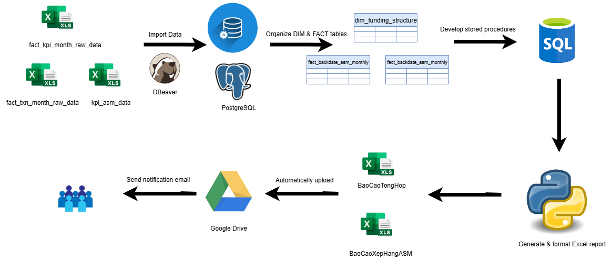

<em>Figure 1: Flow chart</em>

Description of Implementation Steps:

## 2.1. Input/Output Overview

### 2.1.1. Input Tables:
The reporting process uses three main input tables, each imported monthly from Excel files:

* fact_txn (Fact table): Transactional data sourced from accounting systems.

* fact_kpi (Fact table): Monthly business KPI data from business development.

* kpi_asm (Fact table): ASM (Area Sales Manager) performance data from finance.

All three input tables are fact tables containing detailed records for each period.

### 2.1.2. Output Reports:

* BaoCaoTongHop: Summary report aggregating business metrics by region.

* BaoCaoXepHangASM: ASM ranking report based on monthly KPIs.

<!-- ## 2.2. Data Validation:

Write SQL scripts to verify the accuracy of the imported data. --> 

## 2.2. Data Model Organization (Dimension & Fact):
To ensure efficient processing and scalability, input data is loaded into normalized fact tables. Supporting dimension tables (such as  funding structures) are used to enrich and organize the data for faster querying and easier maintenance. This data model reduces redundancy, improves data integrity, and optimizes report generation speed.

### 2.2.1. Summary Report:

* Dimension table: dim_funding_structure
    * _funding_id_: This is the primary key of the table, used to uniquely identify each financial item. It is also used as a foreign key in the fact_backdate_funding_monthly table to link transaction data to a specific item.

    * _funding_code_: An identifier for the item, typically a short and standardized code defined by business requirements (e.g., pf01, pf02).

    * _funding_parent_id_: This is the most critical column for creating the hierarchical structure. It contains the funding_id of the parent item. 

    * _funding_level_ : Defines the item's level in the hierarchy tree. Level 0 is the highest level (e.g., Lợi nhuận trước thuế [Profit before tax]), level 1 items are children of level 0, and so on. This column makes it easier to query and display data by level.

    * _sortorder_: This column is used to determine the display order of items on a report. Items are sorted based on this value, ensuring that reports always have a consistent and structured layout as required by the Finance department.

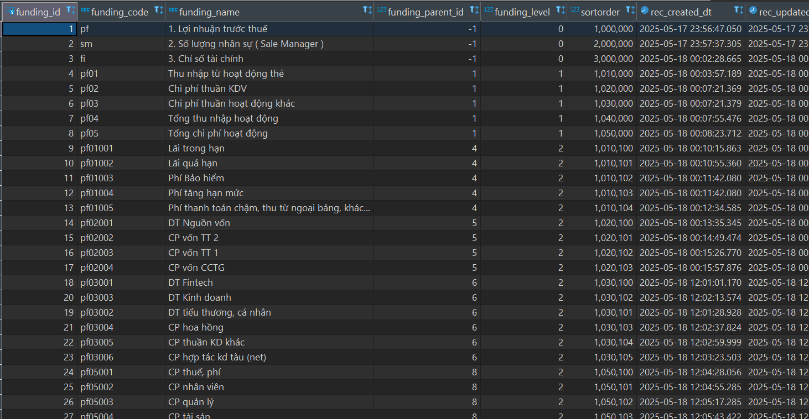

<em>Figure 2: dim_funding_structure table</em>

    
* Fact table: fact_backdate_funding_monthly

    * _month_key_: This column stores the month and year as an integer (e.g., 202305 for May 2023). I created this column to enable "backdating," which is the ability to easily process or reload data for past periods. When the stored procedure is executed with a specific month_key, it will delete the data for that month and insert the new, processed data. This is crucial for maintaining data integrity when there are adjustments or updates for past months.

    * _area_code_: This column represents the business area or geographical region where the financial data is recorded (e.g., 'A', 'B', 'C'). It allows you to analyze financial performance by region.

    * _amount_: This is the column containing the value of the corresponding financial item. Based on the image, this column can store both positive values (e.g., revenue, profit) and negative values (e.g., costs, losses). It is the primary measure used in the financial reports.
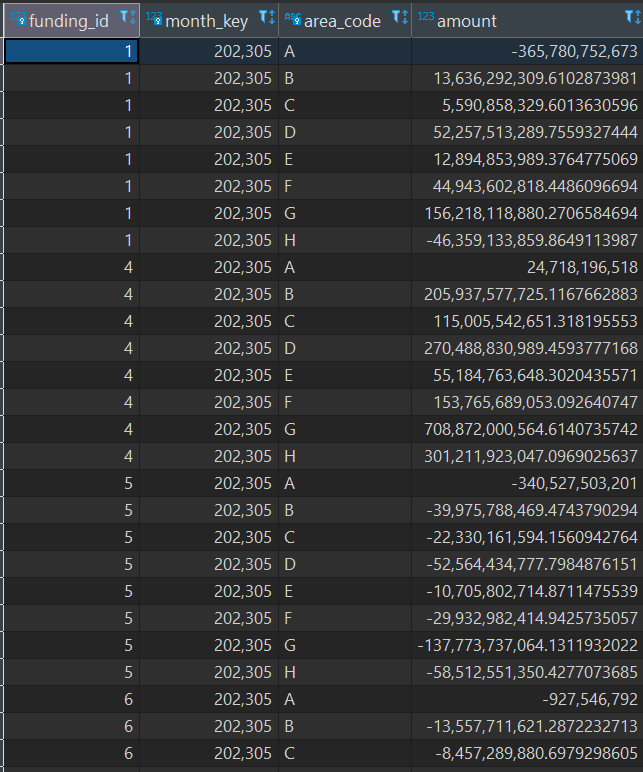

<em>Figure 3: fact_backdate_funding_monthly table</em>

### 2.2.2. ASM Ranking Report:
* Fact table: fact_backdate_asm_monthly, I added some special columns like:
    * _month_key_: An integer representing the specific month and year of the data. This allows for historical performance tracking and backdating.

    * _area_cde_: A code that represents the business region the ASM belongs to (e.g., 'F', 'B', 'C').

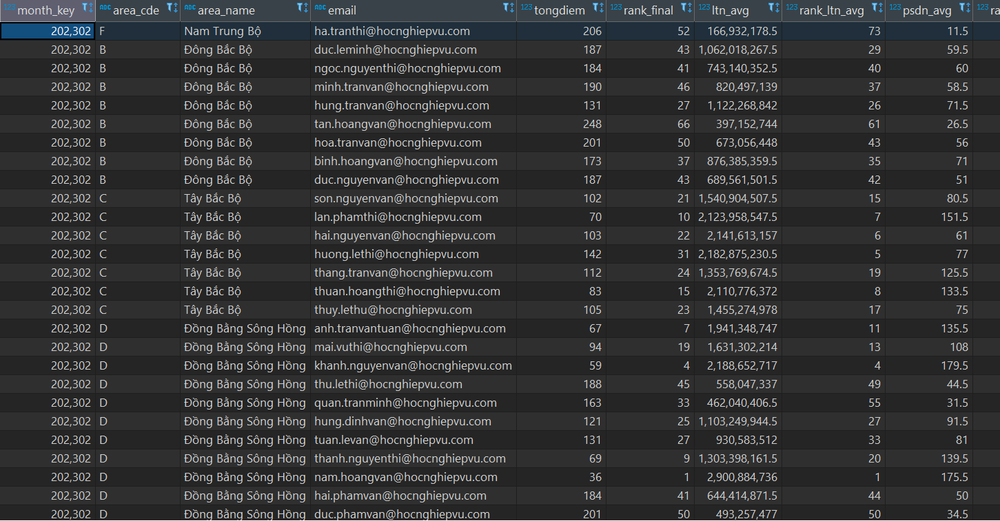

<em>Figure 4: fact_backdate_asm_monthly table</em>

## 2.3. Create log_tracking Table:

Record the start time, end time, and any errors (if applicable) during the processing.

<!-- 2.5. Create area_mapping Table:

Map area_code to the corresponding list of provinces.

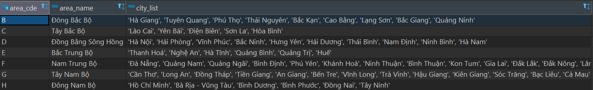 -->

## 2.4. Write Stored Procedure:

When passing the target month as a parameter:
* Delete data for that month from the relevant tables.
* Load new processed data into the tables.
* Construct SQL queries to retrieve data in the required format for the two report sheets.

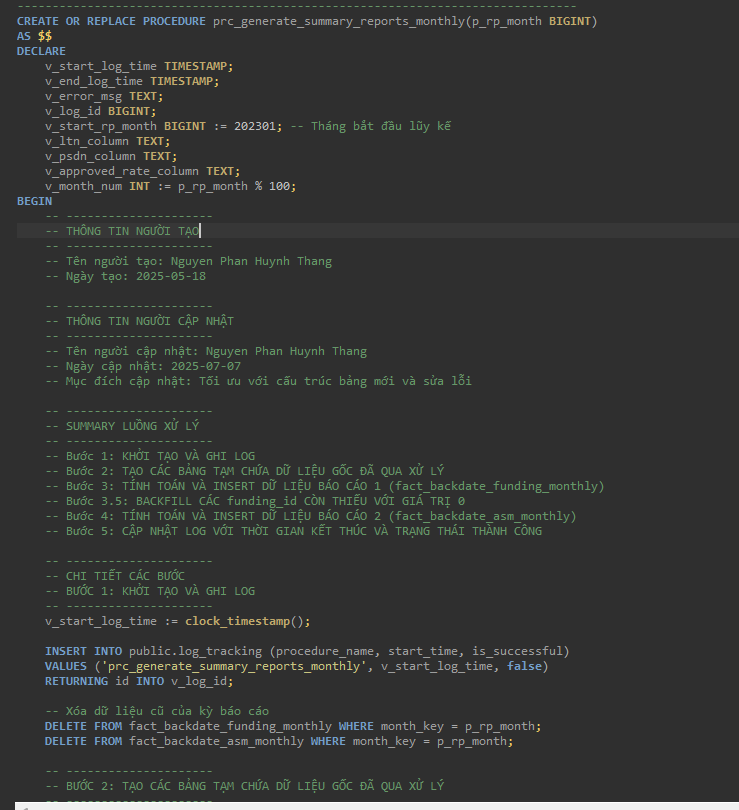

<em>Figure 5: Stored Procedure</em>

**Note**: After the procedure is developed, it must be executed to validate the output against the sample report.

## 2.5. Indexing:

Create indexes on key columns from the input data to improve the performance of the Stored Procedure. Example: account_code,analysis_code, kpi_month, pos_city, etc

<!--  -->

## 2.6. Build Queries for Sheets:

Develop SQL functions to retrieve data in the exact format required for each sheet in the resulting Excel file.

<!-- 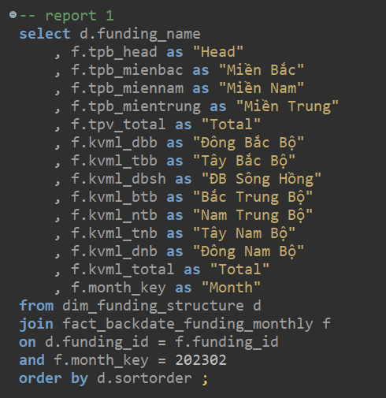

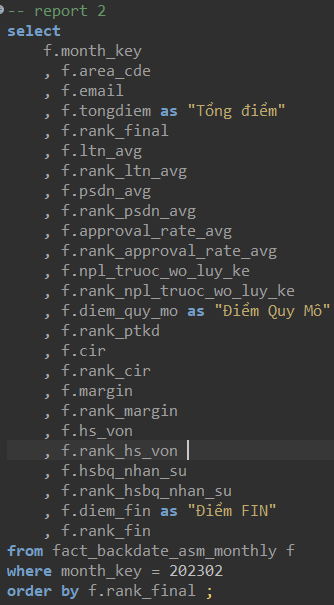 -->

## 2.7. Execute with Python:

* Use Python to execute the SQL queries.

<!-- 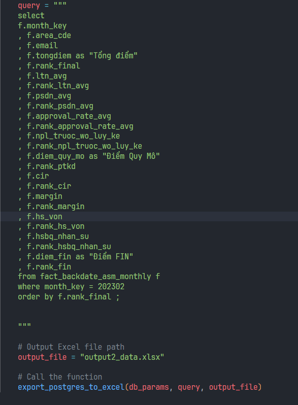 -->

* Modify Python code to apply custom formatting to the Excel file (e.g., set fonts, apply cell colors, adjust column widths, and configure number formats).

* Write the results to an Excel file.

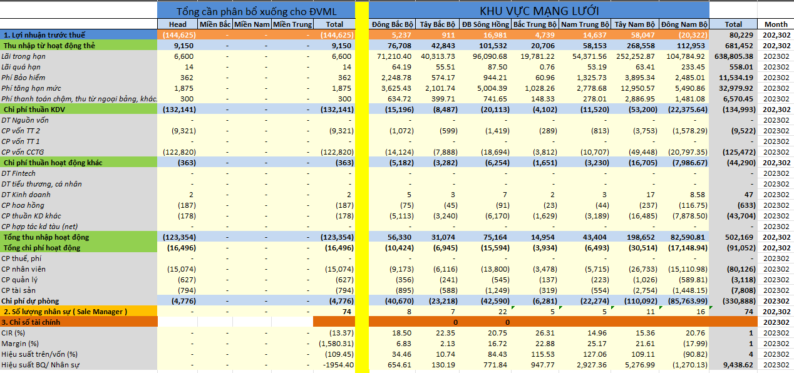

<em>Figure 6: BaoCaoTongHop formatted</em>

## 2.8. Auto-Upload to Google Drive

After generating and formatting the Excel file, use Python’s Google Drive API client to authenticate (via OAuth or service account) and automatically upload or overwrite the file in a specified Drive folder, ensuring access permissions are configured so that only members of the Finance department can view the report.

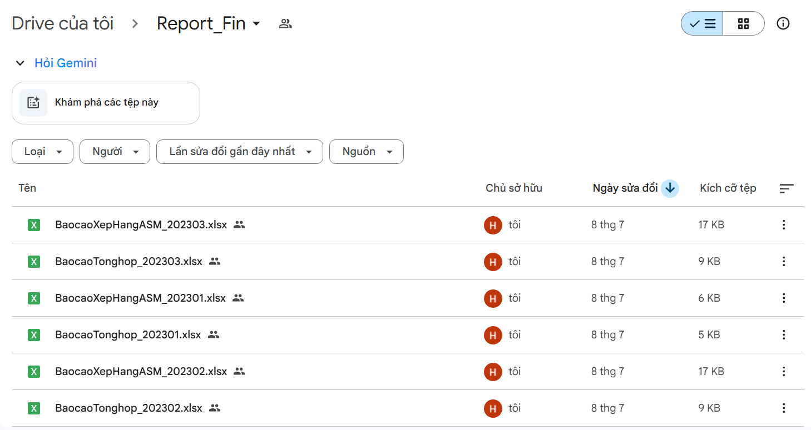

<em>Figure 7: Finance department folder</em>

Additionally, after a successful upload, the script will automatically send a status notification email to relevant department staff to confirm the upload, including a link to the new report file.

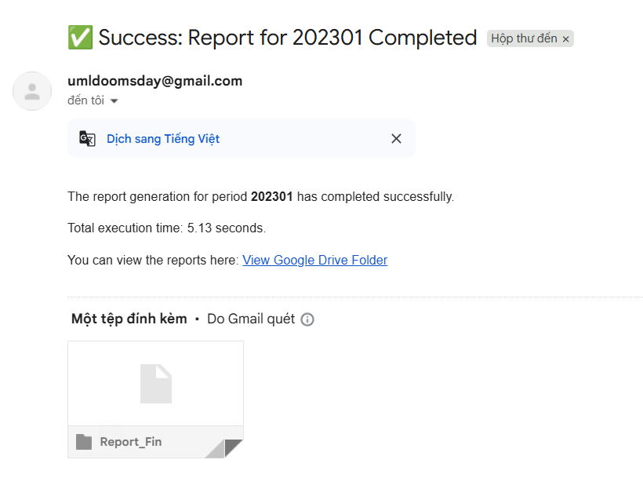

<em>Figure 8: Sending notification email</em>

## 2.9. Scheduled task
To automate report generation, set up a scheduled job in Windows Task Scheduler to run the Python script on the first day of each month

# 3. Skills and Achievements After Completing the Project
## 3.1. Tool Skills
* PostgreSQL: Wrote and executed Stored Procedures and complex SQL queries to process and extract reporting data.

* Python: Used Python to orchestrate the entire workflow, from executing SQL queries to creating and formatting the Excel file.

* Excel: Formated and Exported Excel reports with complex custom formatting (e.g., fonts, colors, column widths) using Python.

* Google Drive API: Utilized the Google Drive API to automate the upload of the final report file to a specified folder.

* Windows Task Scheduler: Configured and used the Windows tool to set up a job for automatic, scheduled monthly execution.

## 3.2. Technical Skills
* Advanced SQL:

    * Developed parameterized Stored Procedures to perform business logic, such as flexibly deleting and reloading data.

    * Optimized query performance by creating and applying indexes on key data columns.

* Python Programming:

    * Integrated Python with a PostgreSQL database to execute data processing routines.

    * Programmed the automation of Excel file creation according to a strict format template required by the end-user.

    * Integrated with external services via API, specifically Google Drive for file uploads and sending email notifications.

* Data Model Design:

    * Organized and built a data model using Dimension and Fact tables (dim_funding_structure, fact_backdate_funding_monthly, etc) to optimize for querying and maintenance.

    * Designed tables with specific columns like month_key to support reprocessing past data ("backdating").

* Process Automation:

    * Built a complete, end-to-end automated workflow, from ingesting input data, processing it, generating reports, to delivering the final product to the user.

    * Set up the process to run on a recurring schedule, ensuring reports are delivered on time without manual intervention.

## 3.3. Domain Knowledge
* Finance & Business Reporting:

    * Understood business requirements from the Finance department to process and consolidate data from various sources (accounting, business development, finance).

    * Built two meaningful business reports: a summary performance report by region (BaoCaoTongHop) and an ASM ranking report (BaoCaoXepHangASM).

* Data Management & ETL:

    * Designed and implemented an ETL (Extract, Transform, Load) process to convert raw data from input tables into structured reports.

    * Applied data integrity methods, such as logging the process history (log_tracking) and validating results against a sample report.
