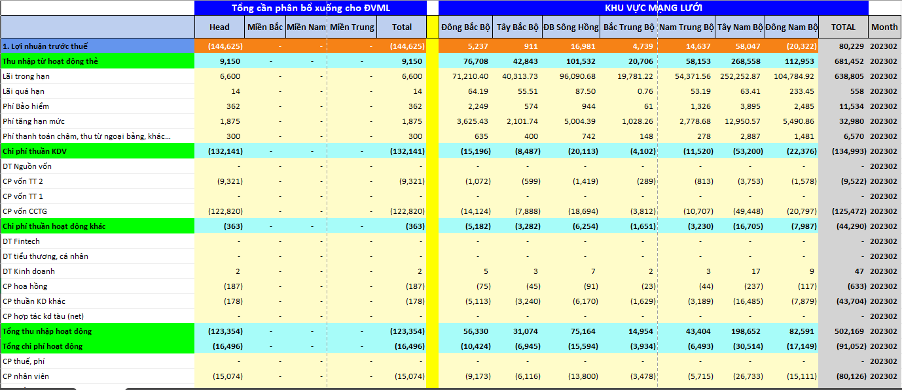

# Business Ranking Report
1. Context

Received a request from the finance department to create these two reports and process data daily, saving the results to an Excel file on Google Drive.

2. Implementation

Flowchart:

Description of Implementation Steps:

2.1. Input Data Flow:

Use DBeaver to import data from 3 Excel files into 3 tables: fact_kpi_month, fact_txn_month, and kpi_asm_data.

2.2. Data Validation:

Write SQL scripts to verify the accuracy of the imported data.

2.3. Data Model Organization (Dimension & Fact):

Objective: Optimize storage.

* Summary Report:

    * Dimension table: dim_funding_structure

    
    
    * Fact table: fact_backdate_funding_monthly

    

* ASM Ranking Report:
    * Fact table: fact_backdate_asm_monthly
    

2.4. Create log_tracking Table:

Record the start time, end time, and any errors (if applicable) during the processing.

2.5. Create area_mapping Table:

Map area_code to the corresponding list of provinces.

2.6. Write Stored Procedure:

When passing the target month as a parameter:
* Delete data for that month from the relevant tables.
* Load new processed data into the tables.
* Construct SQL queries to retrieve data in the required format for the two report sheets.

2.7. Indexing:

Create indexes on key columns from the input data to improve the performance of the Stored Procedure.

2.8. Build Queries for Sheets:

Develop SQL queries to retrieve data in the exact format required for each sheet in the resulting Excel file.

2.9. Execute with Python:

* Use Python to execute the SQL queries.

* Write the results to an Excel file.

* Adjust the Excel file formatting (font, colors, column widths, etc.).

2.10. Upload to Google Drive:

Automatically upload the completed Excel file to Google Drive.

3. Skills and Achievements After Completing the Project

Completing this project enhances tool skills, technical skills, and knowledge in the following domains:

3.1. Tool Skills

* PostgreSQL/DBeaver: Proficient in using PostgreSQL for querying data and DBeaver for managing, importing/exporting data from Excel.
* Excel: Skilled in processing and exporting data to Excel files through Python automation.
* Python IDE (VS Code/PyCharm): Effective use of development environments to write, debug, and run Python scripts.
* Google Drive: Experienced in utilizing Google Drive for cloud storage, file synchronization, and collaborative document management.

3.2. Technical Skills

SQL:
* Write and optimize complex SQL queries to extract data from PostgreSQL (e.g., querying the fact_backdate_asm_monthly table with ranking and KPI columns).
* Handle large datasets with filtering and sorting conditions.
* Use Stored Procedures to automate processes.

Python:
* Utilize the psycopg2 library to connect to and query PostgreSQL databases.
* Process data with pandas to create DataFrames and export to Excel.
* Manage errors and database connections using try-except blocks, ensuring safe connection closure.

Database Management:
* Understand how to retrieve and manage data in fact tables for reporting purposes.
* Skilled in handling complex data columns such as financial KPIs and rankings.

3.3. Domains

Finance:
* Gain deep understanding of financial KPIs (e.g., tongdiem, ltn_avg, approval_rate_avg, npl_truoc_wo_luy_ke) and ASM ranking reports.
* Master the organization of data to support financial reporting and performance evaluation.

Data Management:
* Skilled in extracting, validating, and processing data from databases to ensure accuracy.
* Apply the ETL process to transform raw data into formatted reports.

This project enhances the ability to use SQL and Python for automating financial reporting, while improving understanding of data management and financial processes in the enterprise.
